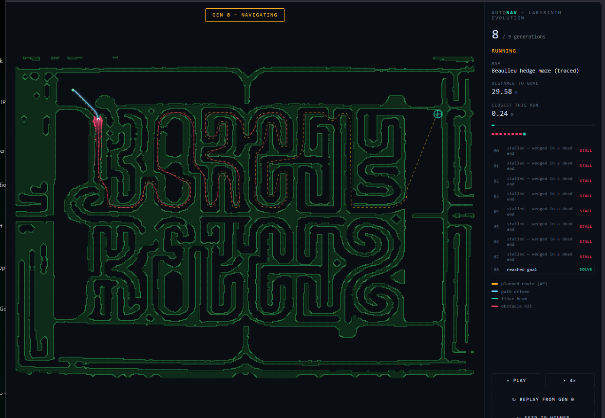

# AutoNav

A 2D autonomous navigation stack written from scratch in modern C++ — the
sense-plan-act loop that drives real mobile robots, with no hardware required.
A differential-drive robot plans a global route with A\*, senses its
surroundings with a simulated lidar, and follows the route while reactively
avoiding obstacles the planner never knew about. A browser visualizer replays
each run.

The intelligence is pure C++ (`include/autonav/`). The web page is only a
replay client — it does no robotics, it just animates a recording the C++
produces.

## What it demonstrates

This is the same architecture used by warehouse robots, delivery bots, and
self-driving research platforms, scaled down to something you can read in an
afternoon:

- **Differential-drive kinematics** with exact arc integration (no Euler drift on turns)
- **A\* global path planning** on an occupancy grid, with octile heuristic, corner-cut prevention, and string-pulling path smoothing
- **Configuration-space obstacle inflation** so the global route keeps the robot's radius of clearance from walls
- **Simulated 2D lidar** via ray casting against the map
- **Dynamic Window Approach (DWA) local planner** — samples reachable velocity commands, rolls each forward, rejects any that would collide, and scores the rest on goal progress, clearance, and speed. Collision-free *by construction*: it cannot select a command that drives into a wall.
- **Local-minimum recovery** so the robot escapes concave traps instead of stalling
- **PID control** with integral anti-windup (used in the earlier controller, kept as a tested component)
- A **fixed-timestep simulation loop** tying it all together
- **Frontier-based exploration** of an *unknown* maze — the same robot, but handed no map and no goal location, builds its own occupancy map from lidar and discovers the exit (see below)

Every component has unit tests — including a full-run test that asserts the
robot never comes within its own radius of any obstacle — and the whole thing
builds with nothing but `g++` and `make`, no external dependencies.

## Build and run

```bash
make test     # build and run the unit test suite
make demo     # build the console demo
./build/autonav_demo
```

The demo plans a route through an office-like map and prints an ASCII trace of
the robot reaching the goal.

### The visualizer

```bash
make web                       # generates web/run.json from a fresh simulation
cd web && python3 -m http.server
# open http://localhost:8000
```

The page loads the recording and animates the robot, the live lidar fan, the
planned path, and the route actually driven, with live telemetry.

## Project layout

```
include/autonav/      the navigation stack (header-only, the real work)
  vec2.hpp            2D vector math + angle wrapping
  occupancy_grid.hpp  grid map with ray collision queries + inflation
  diff_drive.hpp      differential-drive motion model
  lidar.hpp           simulated laser scanner
  astar.hpp           A* planner + path smoothing
  dwa_planner.hpp     Dynamic Window Approach local planner (the brain)
  nav_controller.hpp  earlier pure-pursuit + PID controller (kept for PID)
  maze.hpp            procedural + photo-traced maze generation
  known_map.hpp       the robot's own lidar-built occupancy map (fog of war)
  frontier_explorer.hpp  frontier-based exploration of an unknown maze
  simulator.hpp       the sense-plan-act loop
examples/
  demo.cpp            console navigation demo with ASCII rendering
  maze_explore.cpp    console frontier-exploration demo
tests/                zero-dependency unit tests
web/                  JSON exporters + browser visualizers (replay only)
```

## How navigation works

1. **Inflate + plan.** Obstacles are grown by the robot's radius, then A\*
   searches the inflated grid for the shortest route from start to goal. A
   string-pulling pass collapses the jagged grid path into clean waypoints.
   Planning on the inflated map means the route already keeps clearance, so the
   local planner never has to follow a path that hugs a wall.
2. **Sense.** Each tick, the lidar casts beams across a 270° field of view and
   reports the range to the nearest obstacle along each.
3. **Decide (DWA).** The local planner samples the velocity commands reachable
   from the current state, rolls each one forward ~1.2s with the kinematic
   model, discards any predicted trajectory that would collide, and scores the
   survivors on goal progress, obstacle clearance, and speed. The best command
   wins. If the robot wedges in a local minimum, a recovery maneuver rotates it
   to find a new heading.
4. **Act.** The differential-drive model integrates the chosen command into a
   new pose, and the loop repeats at 20 Hz.

## The labyrinth challenge (evolution visualizer)

A harder test than the office map: drive the robot through a full **labyrinth**,
and watch generation after generation **fail and retry** until one finally
solves it — always.



*Generation 8 reaches the goal after eight earlier attempts stall out. The
"BEAULIEU ABBEY" lettering is the hedge sculpture of the real maze; the robot
threads the open corridors around it.*

Two maze sources are provided:

- **The traced Beaulieu hedge maze** (`make maze`) — segmented from the
  reference photograph and rebuilt as a navigable occupancy grid, with the
  lettering kept solid and legible. A compact indoor-robot footprint
  (~0.07 m radius) lets it fit the real corridors. Deterministic: same maze
  every run.
- **A seeded procedural maze** (`make maze MAP=seeded SEED=7`) — a perfect maze
  from a recursive backtracker, fully reproducible from its integer seed, driven
  by the standard-footprint robot.

```bash
make maze                       # photo-traced Beaulieu maze -> web/maze_run.json
make maze MAP=seeded SEED=7     # procedural maze from seed 7
cd web && python3 -m http.server
# open http://localhost:8000/maze.html
```

### How the "generations" work

`web/gen_maze_evolution.cpp` runs a **swarm evolution**. Each **generation**
releases a swarm of dots from the same start, and the swarm *grows and improves*
over generations: early generations are small (a handful of dots) and clumsy
(heavy exploration noise, so they wander off and stall); later generations are
larger and sharper (less noise, tighter tracking), so more dots complete the
maze. The dots split across **two distinct routes** to the goal — a fast direct
path and a longer scenic detour — so the swarm visibly explores more than one
way through. Convergence is guaranteed: A\* proves both routes are solvable, and
by the final generation a large, confident swarm reaches the goal along both.

Every dot's full trajectory is recorded to `web/maze_run.json`. The visualizer
(`web/maze.html`) replays each generation in order: dots that reach the goal glow
cyan/green, dots that give up fade red, faint ghosts of past generations show the
swarm learning the maze over time, and the ledger tallies how many of each
generation's dots solved it. Use **skip to winner** to jump to the final swarm,
or the speed control to fast-forward.

### Local HTTPS (optional)

To serve the visualizer over HTTPS for local dev (with a locally-trusted
[mkcert](https://github.com/FiloSottile/mkcert) certificate):

```bash
mkcert -install          # once, installs the local CA
mkcert localhost         # generates localhost.pem + localhost-key.pem
cd web && python serve_https.py   # serves https://localhost:8443/maze.html
```

## Solving an unknown maze (frontier exploration)

Everything above hands the robot the map up front — A\* plans on it, and the
labyrinth's swarm evolves DWA parameters against a maze it can already see. This
mode removes that assumption entirely: the robot starts with **no map and no
idea where the goal is**, and has to *discover* the way out.

It runs the standard **frontier-based exploration** algorithm every tick:

1. **Sense and map.** The lidar scan is fused into the robot's own occupancy
   grid (`known_map.hpp`) with a ray-cast inverse sensor model: every cell a
   beam passes through is marked free, the cell that stops it is marked a wall,
   and everything unseen stays *unknown*. This belief is built from scratch —
   never the simulator's ground-truth map.
2. **Find frontiers.** Frontiers are known-free cells that border unknown space
   — the edges of the explored region, where new information lives.
3. **Go to the nearest one.** A breadth-first search over *known-free* cells from
   the robot's position picks the closest reachable frontier, and the robot
   steers toward it, slowing near walls it has already discovered.
4. **Repeat until the goal is seen.** Exploration ends the instant the goal cell
   enters the known-free region — the robot has literally *seen* the exit. It can
   never beeline there, because it only ever plans over space it has confirmed.

```bash
make maze_explore               # console demo: prints exploration progress
make explore                    # writes web/explore_run.json for the viewer
cd web && python3 -m http.server
# open http://localhost:8000/explore.html
```

`web/explore.html` replays the run with the fog of war lifting as the robot maps
the maze — discovered walls fill in, the robot's trajectory traces its search,
and the true maze shows faint underneath for reference.

## Notes


Written as a learning project to work through the core algorithms of mobile
robot autonomy by implementing them rather than importing them. The local
planner began as a pure-pursuit + reactive-avoidance controller; it was
replaced with DWA after the reactive version oscillated at tight corners — the
new planner is collision-free by construction, verified by a full-run test.
The simulation is deterministic and noise-free so the planning logic stays the
focus; adding sensor noise, a particle-filter localizer, or replanning when the
path is blocked would be natural next steps.
